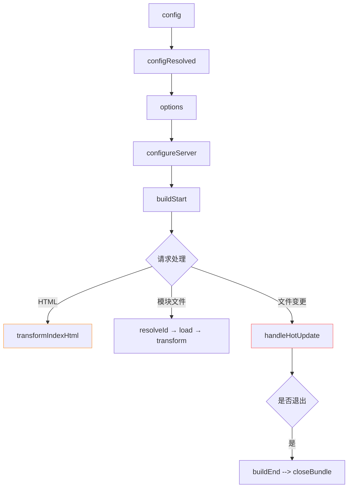
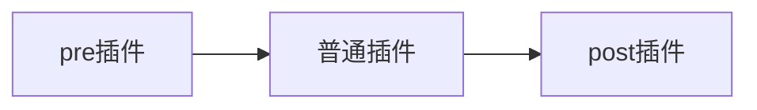

- 虽然 Vite 的插件机制是基于 Rollup 来设计的，并且上一小节我们也已经对 Rollup 的插件机制进行了详细的解读，但实际上 Vite 的插件机制也包含了自己独有的一部分，与 Rollup 的各个插件 Hook 并非完全兼容，因此本节我们将重点关注 Vite 独有的部分以及和 Rollup 所区别的部分


## 1. 例子

```ts

{
  // 插件名称
  name: 'vite-plugin-xxx',
  load(code) {
    // 钩子逻辑
  },
}
//工厂函数 写法
export function myVitePlugin(options) {
  console.log(options)
  return {
    name: 'vite-plugin-xxx',
    load(id) {
      // 在钩子逻辑中可以通过闭包访问外部的 options 传参
    }
  }
}

// 使用 vite.config.ts
import { myVitePlugin } from './myVitePlugin';
export default {
  plugins: [myVitePlugin({ /* 给插件传参 */ })]
}
```

##  2.插件 Hook 介绍

### 2.1 通用 Hook


其中 Vite 会调用一系列与 Rollup 兼容的钩子，这个钩子主要分为三个阶段:

- **服务器启动阶段**: `options`和`buildStart`钩子会在服务启动时被调用。
- **请求响应阶段**: 当浏览器发起请求时，Vite 内部依次调用`resolveId`、`load`和`transform`钩子。
- **服务器关闭阶段**: Vite 会依次执行`buildEnd`和`closeBundle`钩子。

除了以上钩子，其他 Rollup 插件钩子(如`moduleParsed`、`renderChunk`)均不会在 Vite **开发阶段**调用。
而生产环境下，由于 Vite 直接使用 Rollup，Vite 插件中所有 Rollup 的插件钩子都会生效。


### 2.2 独有 Hook

### 2.2.1 配置处理钩子
config - 修改配置
```js
config(config, { command, mode }) {
  // command: 'serve'开发模式 | 'build'生产模式
  // mode: 'development' | 'production' | 自定义模式

  if (command === 'serve') {
    return {
      server: {
        port: 3000, // 修改开发服务器端口
        open: true  // 自动打开浏览器
      }
    }
  }

  // 生产环境配置
  return {
    build: {
      minify: 'terser'
    }
  }
}
```
configResolved - 配置确认
```js
let finalConfig

configResolved(resolvedConfig) {
  // 就像拍照记录最终配置
  finalConfig = resolvedConfig
  console.log('最终端口号:', finalConfig.server.port)
}

// 在其他钩子中可以使用
transform() {
  console.log('当前运行模式:', finalConfig.mode)
}
```
### 2.2.2 开发服务器钩子
configureServer - 扩展开发服务器
```js
configureServer(server) {
  // 添加中间件（像express中间件）
  server.middlewares.use('/api', (req, res) => {
    res.end('Hello from plugin!')
  })

  // 返回的函数会在核心中间件后执行
  return () => {
    server.middlewares.use((req, res, next) => {
      console.log(`请求URL: ${req.url}`)
      next()
    })
  }
}
```

### 2.2.3 HTML 处理钩子
transformIndexHtml - 修改 HTML
```js
transformIndexHtml(html, ctx) {
  // 方式1：简单替换
  const newHtml = html.replace('<title>', '<title>我的网站')

  // 方式2：高级操作（推荐）
  return {
    html: newHtml,
    tags: [{
      tag: 'script',
      injectTo: 'body-prepend',
      attrs: { src: '/inject.js' }
    }, {
      tag: 'meta',
      injectTo: 'head',
      attrs: { name: 'keywords', content: 'vite,plugin' }
    }]
  }
}
```

### 2.2.4 热更新处理
handleHotUpdate - 自定义热更新
```js
handleHotUpdate(ctx) {
  // ctx包含热更新上下文
  if (ctx.file.includes('config')) {
    // 发送自定义事件
    ctx.server.ws.send({
      type: 'custom',
      event: 'config-changed',
      data: { file: ctx.file }
    })
    return [] // 阻止默认热更新
  }

  // 只更新特定模块
  return ctx.modules.filter(m => !m.id.includes('node_modules'))
}
```
前端代码接收热更新：
```js
if (import.meta.hot) {
  import.meta.hot.on('config-changed', (data) => {
    console.log('配置文件修改了:', data.file)
    location.reload() // 刷新页面
  })
}
```

eg 图片处理插件

```js
import sharp from 'sharp'

export default function imagePlugin() {
  return {
    name: 'vite-plugin-image',

    // 转换图片为webp
    async transform(code, id) {
      if (/\.(png|jpe?g)$/.test(id)) {
        const buffer = await sharp(id)
          .resize(800)
          .webp()
          .toBuffer()
        return `export default ${JSON.stringify(buffer.toString('base64'))}`
      }
    },

    // 添加图片处理提示
    transformIndexHtml() {
      return {
        tags: [{
          tag: 'script',
          injectTo: 'head',
          children: 'console.log("图片优化插件已启用")'
        }]
      }
    }
  }
}

```


### 2.3 插件 Hook 执行顺序

#### 2.3.1 钩子执行全过程
`[启动阶段] → [请求阶段] → [热更新] → [关闭阶段]`

#### 2.3.2 各阶段详解

##### 1.启动阶段
```js
// vite-plugin-test.ts
import type { PluginOption } from 'vite'

export default function vitePluginTest(): PluginOption {
  // 存储最终配置
  let finalConfig: any

  return {
    name: 'vite-plugin-test',

    // 1. 修改配置
    config(config, { command, mode }) {
      console.log('（config）', config)
      return {
        server: {
          port: 5173,
          open: '/welcome'
        }
      }
    },

    // 2. 记录最终配置
    configResolved(config) {
      console.log('（configResolved）')
      finalConfig = config
    },

    // 3. 修改Rollup选项
    options(opts) {
      console.log('（options）')
      return { ...opts, treeshake: 'recommended' }
    },

    // 4. 扩展开发服务器
    configureServer(server) {
      console.log('（configureServer）')
      server.middlewares.use('/smart', (req, res) => {
        res.end('server')
      })
    },

    // 5. 构建开始
    buildStart() {
      console.log('构建开始')
    }
  }
}

```

img 16


##### 2.请求处理

```js
// 对于HTML文件（支持多入口）
transformIndexHtml(html, { path }) {
  console.log(`【数字菜单】定制 ${path} 页面`)
  return {
    html,
    tags: [{
      tag: 'script',
      injectTo: 'head',
      attrs: { type: 'module', src: '/src/ai-helper.js' } // Vite 7支持更智能的注入
    }]
  }
}

// 对于JS/TS等文件（性能优化）
resolveId: {
  filter: /\.(jsx?|tsx?)$/, // Vite 7支持更精确的过滤
  handler(source) {
    console.log('分析（resolveId）')
  }
},
load(id) {
  console.log('加载（load）')
},
transform(code, id) {
  if (id.endsWith('.jsx')) {
    console.log('（transform）')
    return transformWithAI(code) // Vite 7增强的转换能力
  }
}
```
##### 3.热更新增强

```js
handleHotUpdate({ file, modules, server, timestamp }) {
  console.log('【监控AI】检测到变更:', file)

  if (file.includes('recipe')) {
    server.ws.send({
      type: 'custom',
      event: 'recipe-update',
      data: { file, timestamp }
    })
    return [] // 跳过默认热更新
  }


  return modules.filter(mod => !mod.id.includes('legacy'))
}
```

##### 4.生产构建
```js
buildEnd() {
  console.log('完成（buildEnd）')
},
closeBundle() {
}
```

#### 2.3.3 完整生命周期流程



#### 2.3.4 实战技巧
- 利用Vite 7的自动优化
```js
config() {
  return {
    build: {
      // 开启Vite 7的新优化模式
      optimizeDeps: { auto: true },
      // 使用新版Rollup配置
      rollupOptions: { treeshake: 'recommended' }
    }
  }
}
```

- 开发智能插件
```js
// 利用Vite 7的AI辅助功能
transform(code, id) {
  if (this.finalConfig.experimental.ai) {
    return viteAI.transform(code, id)
  }
}
```

- 适配多环境
```js
configureServer(server) {
  // Vite 7支持多环境配置
  if (server.config.mode === 'testing') {
    server.middlewares.use('/mock', mockAPI)
  }
}
```

## 3.插件应用位置
### 3.1  插件应用场景控制
```js
export default function myPlugin() {
  return {
    name: 'vite-plugin-env-control',

    // 方式1：简单指定环境
    apply: 'build', // 仅在生产构建时运行

    // 方式2：函数精确控制（Vite 7 新增支持异步函数）
    apply(config, { command, mode }) {
      // 仅在生产非SSR模式下启用
      return command === 'build' && !config.build.ssr
    },

    // 插件实现...
  }
}
```
eg
```js
{
  name: 'dev-only-plugin',
  apply: 'serve',
  configureServer(server) {
    console.log('只在开发服务器运行')
  }
}
```

### 3.2  插件执行顺序控制

#### 3.2 1 预置插件（enforce: 'pre'）

 需要优先处理的路径别名 代码转换前的预处理
```js

export default function prePlugin() {
  return {
    name: 'vite-plugin-pre',
    enforce: 'pre', // 最先执行

    config() {
      console.log('最先执行的配置修改')
    }
  }
}
```

#### 3.2.2 普通插件（默认）


```js

export default function normalPlugin() {
  return {
    name: 'vite-plugin-normal',
    // 不设置enforce

    transform(code) {
      console.log('正常顺序执行')
    }
  }
}
```

#### 3.2.3 后置插件（enforce: 'post'）
最终代码优化 构建产物分析 压缩前的最后处理
```js
export default function postPlugin() {
  return {
    name: 'vite-plugin-post',
    enforce: 'post', // 最后执行

    transform(code) {
      console.log('最后执行的转换')
    }
  }
}
```


### 3.3  完整执行流程
- Alias 处理：@/ 等路径转换

- pre 插件：enforce: 'pre' 的插件

- Vite 核心插件：内置的 React/Vue 等插件

- 普通插件：用户插件（无 enforce）

- 构建插件：Vite 生产环境专用插件

- post 插件：enforce: 'post' 的插件

- 后处理插件：压缩、manifest 等

简单的规则：

- pre → 最早执行（适合预处理）

- 无 enforce → 中间执行（大部分插件）

- post → 最后执行（适合后处理）


## 4. 插件开发实战

### 1.像使用React组件一样使用SVG文件

```js
// plugins/svgr.ts
import type { Plugin } from 'vite'
import fs from 'node:fs/promises'
import { transform } from '@svgr/core'
import { transform as esbuildTransform } from 'esbuild'

interface SvgrOptions {
  defaultExport?: 'url' | 'component'
  svgrOptions?: Record<string, any>
}

export default function svgrPlugin(options: SvgrOptions = {}): Plugin {
  const { defaultExport = 'component', svgrOptions = {} } = options

  return {
    name: 'vite-plugin-svgr',
    async transform(_, id) {
      if (!id.endsWith('.svg')) return

      try {
        const svg = await fs.readFile(id, 'utf-8')

        // 1. 使用更安全的SVGR配置
        const componentCode = await transform(
          svg,
          {
            ...svgrOptions,
            plugins: ['@svgr/plugin-jsx', '@svgr/plugin-prettier'],
            typescript: true,
            jsxRuntime: 'automatic',
            exportType: 'named',
            template: ({ componentName, jsx }, { tpl }) => {
              return tpl`
                const ${componentName} = (props) => ${jsx};
                export { ${componentName} };
              `
            }
          },
          { componentName: 'ReactComponent' }
        )

        // 2. 清理和标准化代码
        let jsCode = componentCode
          .replace(/^\/\*.*?\*\/\s*/gms, '') // 移除注释
          .replace(/\n+/g, '\n') // 压缩空行
          .trim()

        // 3. 处理导出逻辑
        if (defaultExport === 'url') {
          jsCode = `
            ${jsCode}
            export default ${JSON.stringify(id)};
          `.trim()
        } else {
          jsCode = `
            ${jsCode}
            export default ReactComponent;
          `.trim()
        }

        // 4. 使用更严格的esbuild配置
        const result = await esbuildTransform(jsCode, {
          loader: 'jsx',
          jsx: 'automatic',
          sourcefile: id,
          format: 'esm',
          target: 'es2020',
          logLevel: 'silent'
        })

        return {
          code: result.code,
          map: result.map || null
        }
      } catch (error) {
        console.error(`SVG转换失败 [${id}]:`, error)
        // 安全回退：返回原始SVG路径
        return {
          code: `export default ${JSON.stringify(id)};`,
          map: null
        }
      }
    }
  }
}

```

//使用
```tsx
import Logo from './vite.svg'

export default function App() {
  return (
    <Logo
      className="icon"
      style={{ color: 'red' }}
    />
  )
}

```

- img 18

原理

- 文件识别：插件通过文件后缀.svg识别SVG文件

- SVGR转换：将SVG代码转换为React组件代码

- 导出控制：根据配置决定默认导出是组件还是URL

- JSX转换：使用esbuild将JSX转换为浏览器可执行代码


## 5.小结 讲述插件中文一些钩子 可以自定义插件

