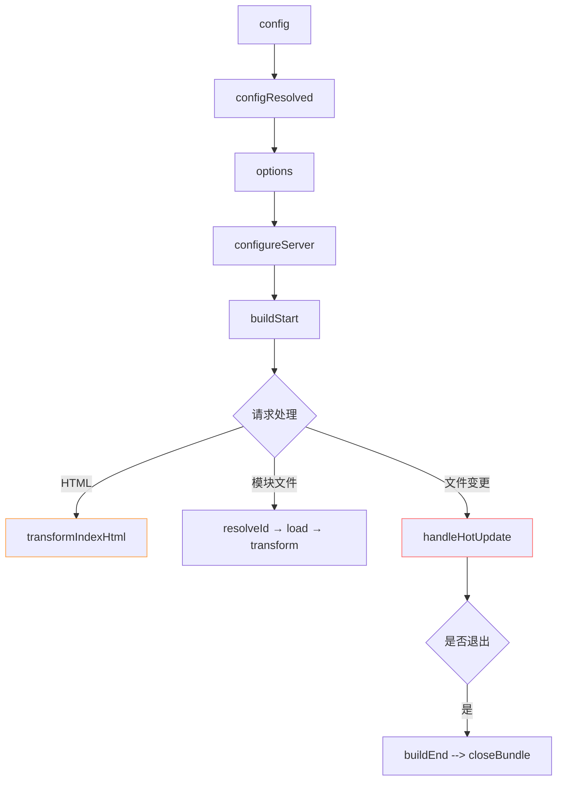

- 虽然 Vite 的插件机制是基于 Rollup 来设计的，并且上一小节我们也已经对 Rollup 的插件机制进行了详细的解读，但实际上 Vite 的插件机制也包含了自己独有的一部分，与 Rollup 的各个插件 Hook 并非完全兼容，因此本节我们将重点关注 Vite 独有的部分以及和 Rollup 所区别的部分


# 1. 简单介绍


## 1.1 名字
- Rollup 插件应该有一个带 rollup-plugin-
- Vite 独有的插件名称格式为 `vite-plugin-xxx`，其中 `xxx` 为插件名称。
插件只适用于特定的框架
- vite-plugin-vue- 前缀作为 Vue 插件
- vite-plugin-react- 前缀作为 React 插件
- vite-plugin-svelte- 前缀作为 Svelte 插件


```ts

{
  // 插件名称
  name: 'vite-plugin-xxx',
  load(code) {
    // 钩子逻辑
  },
}
//工厂函数 写法
export function myVitePlugin(options) {
  console.log(options)
  return {
    name: 'vite-plugin-xxx',
    load(id) {
      // 在钩子逻辑中可以通过闭包访问外部的 options 传参
    }
  }
}

// 使用 vite.config.ts
import { myVitePlugin } from './myVitePlugin';
export default {
  plugins: [myVitePlugin({ /* 给插件传参 */ })]
}
```

## 1.2 强制插件排序

为了与某些 Rollup 插件兼容，可能需要强制修改插件的执行顺序，或者只在构建时使用。
可以使用 enforce 修饰符来强制插件的位置

- pre: 在vite核心插件之前调用这个插件
- post: 在vite核心插件之后调用这个插件
- 默认：在 Vite 核心插件之后调用该插件
```ts
import image from '@rollup/plugin-image'
import { defineConfig } from 'vite'

export default defineConfig({
  plugins: [
    {
      ...image(),
      enforce: 'pre',
    },
  ],
})
```
## 1.3 按需引入
-  开发 (serve) 和生产 (build) 默认都会调用
-  apply 属性指明它们仅在 'build' 或 'serve' 模式时调用：
```ts
import typescript2 from 'rollup-plugin-typescript2'
import { defineConfig } from 'vite'

export default defineConfig({
  plugins: [
    {
      ...typescript2(),
      apply: 'build',
    },
  ],
})
```


# 2 虚拟模块

## 2.1什么是虚拟模块
- 虚拟模块就像是你凭空创造出来的 JavaScript 文件，它不在你的电脑上真实存在，但可以被其他模块像普通文件一样导入使用。


## 2.2 基本工作原理
```js
export default function myPlugin() {
  // 定义虚拟模块ID（用户看到的）
  const virtualModuleId = 'virtual:my-module'
  // 实际内部使用的ID（加\0前缀）
  const resolvedVirtualModuleId = '\0' + virtualModuleId

  return {
    name: 'my-plugin',
    // 解析模块ID
    resolveId(id) {
      if (id === virtualModuleId) {
        return resolvedVirtualModuleId // 告诉Vite："这个模块我来处理"
      }
    },
    // 加载模块内容
    load(id) {
      if (id === resolvedVirtualModuleId) {
        return `export const msg = "来自虚拟模块的问候"` // 凭空生成的内容
      }
    }
  }
}

```
```js
//配置
// vite.config.js
import { defineConfig } from 'vite'
import virtualPlugin from './plugins/virtual-plugin'

export default defineConfig({
  plugins: [virtualPlugin()]
})

//使用
import { msg } from 'virtual:my-module'

console.log(msg)
```
为啥加\0前缀？
- 标记特殊身份：告诉其他插件"这个模块已经有人处理了"

- 避免冲突：防止被 Node.js 等系统当作真实文件处理

- 开发环境转换：浏览器中会变成 /@id/__x00__{id} 的形式

注意：
- 公共插件使用 virtual:插件名 格式（如 virtual:posts）


## 2.3 注意事项

- 1. 虚拟模块在生产的时候 最好显示配置一下
```js
export default {
  plugins: [virtualPlugin()],
  build: {
    rollupOptions: {
      plugins: [virtualPlugin()] // 显式注册
    }
  }
}
```
- 2. 不配置会有啥后果？
虚拟模块在生产环境中的可用性取决于具体场景

- 基本虚拟模块（仅生成静态内容）：

-  通常可以工作：如果插件只是生成简单的静态内容

- 原因：Vite 会继承主插件数组中的插件配置

- 复杂虚拟模块（依赖特定钩子或转换）：

- ❌ 可能失败：如果插件依赖 build 阶段的特定钩子

- 报错表现：Cannot find module 'virtual:xxx' 或生成的内容不正确

- 依赖 transform 等构建特定钩子 依赖构建时的特定阶段（如 renderChunk) 要加


##  2.插件 Hook 介绍

### 2.1 通用 Hook

- Vite 开发服务器会创建一个插件容器来调用 Rollup 构建钩子


其中 Vite 会调用一系列与 Rollup 兼容的钩子，这个钩子主要分为三个阶段:

- **服务器启动阶段**: `options`和`buildStart`钩子会在服务启动时被调用。
- **请求响应阶段**: 当浏览器发起请求时，Vite 内部依次调用`resolveId`、`load`和`transform`钩子。
- **服务器关闭阶段**: Vite 会依次执行`buildEnd`和`closeBundle`钩子。

除了以上钩子，其他 Rollup 插件钩子(如`moduleParsed`、`renderChunk`)均不会在 Vite **开发阶段**调用。
而生产环境下，由于 Vite 直接使用 Rollup，Vite 插件中所有 Rollup 的插件钩子都会生效。


- moduleParsed:

这个钩子在模块解析后触发，允许你修改模块的元数据。
在开发阶段不被调用，因为 Vite 使用的是热重载和即时模块更新，不需要完整的模块解析阶段。

- renderChunk:
在生成输出块时调用，允许你自定义生成的代码块。
开发阶段不调用，因为 Vite 主要依赖浏览器的即时更新，而非生成最终的打包输出。


### 2.2 独有 Hook

- config 在解析 Vite 配置前调用。钩子接收原始用户配置
- configResolved 在解析 Vite 配置后调用 使用这个钩子读取和存储最终解析的配置
- configureServer 是用于配置开发服务器的钩子
- configurePreviewServer 用于定制预览服务器的钩子，类似configureServer 但专门用vite preview 命令启动的预览服务器。
- transformIndexHtml 专门用来修改 index.html 文件的钩子
- handleHotUpdate 自定义热模块替换(HMR)行为的钩子


### 2.2.1 配置处理钩子
config - 修改配置
```js
config(config, { command, mode }) {
  // command: 'serve'开发模式 | 'build'生产模式
  // mode: 'development' | 'production' | 自定义模式

  if (command === 'serve') {
    return {
      server: {
        port: 3000, // 修改开发服务器端口
        open: true  // 自动打开浏览器
      }
    }
  }

  // 生产环境配置
  return {
    build: {
      minify: 'terser'
    }
  }
}
```
configResolved - 配置确认
```js
const myPlugin = () => {
  let viteConfig // 用于存储配置

  return {
    name: 'my-plugin',

    // configResolved 钩子
    configResolved(resolvedConfig) {
      // 存储最终解析的配置
      viteConfig = resolvedConfig
      console.log('当前运行模式:', viteConfig.command)
    },

    // 在其他钩子中使用配置
    transform(code, id) {
      if (viteConfig.command === 'serve') {
        console.log('开发模式处理:', id)
      } else {
        console.log('生产构建处理:', id)
      }
      return code
    }
  }
}
```


```js
configResolved(config) {
  this.isDev = config.command === 'serve'
  this.isProduction = !this.isDev
},

load(id) {
  if (id === virtualModuleId) {
    return this.isDev
      ? `export const mode = 'development'`
      : `export const mode = 'production'`
  }
}
```
### 2.2.2 开发服务器钩子
configureServer - 扩展开发服务器
- 添加自定义中间件：在开发服务器中添加自定义请求处理逻辑

- 监听文件变化：响应特定文件的变化并执行相应操作

- 修改服务器配置：在服务器启动前调整配置

- 访问服务器实例：获取完整的服务器控制权
```js
configureServer(server) {
  //这个中间件会在Vite内置中间件之前执行
  // 添加中间件  http://localhost:3000/api/data 会返回 JSON 数据
  server.middlewares.use('/api/data', (req, res) => {
    res.setHeader('Content-Type', 'application/json')
    res.end(JSON.stringify({ data: '测试数据' }))
  })
  //监听文件变化
  server.watcher.on('change', (file) => {
    if (file.includes('config.json')) {
      server.ws.send({
        type: 'full-reload', //指定重载类型为"完全重载
        path: '*' //表示重载所有页面
      })
    }
  })

  // 返回的函数会在核心中间件后执行
  return () => {
    server.middlewares.use((req, res, next) => {
      console.log(`请求URL: ${req.url}`)
      next()
    })
  }
}
```


```js
configureServer(server: ViteDevServer): void | (() => void)
```
参数 server 包含以下重要属性：

- middlewares: Connect 中间件实例

- httpServer: 底层 HTTP 服务器

- watcher: 文件监听器

- ws: WebSocket 服务器

- transformRequest(): 用于转换模块内容


eg
```js
 //权限检查
configureServer(server) {
  server.middlewares.use((req, res, next) => {
    if (req.url.startsWith('/admin') && !req.headers['auth-token']) {
      res.statusCode = 401
      return res.end('需要登录')
    }
    next()
  })
}

//文件监控

export default function myPlugin() {
  let server

  return {
    name: 'file-watcher',
    configureServer(_server) {
      server = _server
      // 监听配置文件变化
      server.watcher.add('config.json')
    },
    handleHotUpdate(ctx) {
      if (ctx.file.endsWith('config.json')) {
        console.log('配置文件已修改!')
        server.ws.send({ type: 'full-reload' })
      }
    }
  }
}
```

注意
- 仅用于开发：生产环境不会调用这个钩子

- 中间件顺序：返回的函数会让中间件最后执行

- 安全访问：其他钩子中使用 server 前要检查是否存在
```js
transform(code, id) {
  // 正确的安全访问方式
  if (this.server) { /* ... */ }
}
```

### 2.2.3 HTML 处理钩子
transformIndexHtml - 修改 HTML
什么时候执行？开发时：每次请求 index.html 时 ｜ 构建时：生成最终 HTML 文件前


```js
transformIndexHtml(html, ctx) {
  // 方式1：简单替换
  const newHtml = html.replace('<title>', '<title>我的网站')

  // 方式2：高级操作（推荐）
  return {
    html: newHtml,
    tags: [{
      tag: 'script',
      injectTo: 'body-prepend',
      attrs: { src: '/inject.js' }
    }, {
      tag: 'meta',
      injectTo: 'head',
      attrs: { name: 'keywords', content: 'vite,plugin' }
    }]
  }
}
```
```html
<head>
  <!-- 其他head内容 -->
  <meta name="keywords" content="vite,plugin">
</head>
<body>
  <script src="/inject.js"></script>
  <!-- 其他body内容 -->
</body>
```

### 2.2.4 热更新处理
handleHotUpdate - 自定义热更新, 修改代码后，页面自动更新而不用刷新
这个钩子可以 控制哪些文件更新需要触发HMR 自定义HMR行为 过滤不必要的更新
```js
handleHotUpdate(ctx) {
  // ctx包含热更新上下文
  if (ctx.file.includes('config')) {
    // 发送自定义事件
    ctx.server.ws.send({
      type: 'custom',
      event: 'config-changed',
      data: { file: ctx.file }
    })
    return [] // 阻止默认热更新
  }

  // 只更新特定模块
  return ctx.modules.filter(m => !m.id.includes('node_modules'))
}
```
前端代码接收热更新：
```js
if (import.meta.hot) {
  import.meta.hot.on('config-changed', (data) => {
    console.log('配置文件修改了:', data.file)
    location.reload() // 刷新页面
  })
}

//过滤特定文件更新
handleHotUpdate({ file, modules }) {
  // 只处理.css文件的更新
  if (file.endsWith('.css')) {
    return modules // 返回受影响的模块
  }
  // 其他文件不触发HMR
  return []
}

handleHotUpdate({ file, server }) {
  if (file.includes('config/')) {
    // 配置文件修改时强制刷新页面
    server.ws.send({ type: 'full-reload' })
    return []
  }
}
```

参数 ctx 包含以下属性：

- file: 发生变化的文件路径

- modules: 发生变化的模块列表

- server: 服务器实例

- timestamp: 发生变化的时间戳

- read 安全的文件读取函数（解决编辑器保存延迟问题）

read() 函数？
有时候编辑器保存文件时，Vite 的文件监听器会比编辑器实际完成写入更快触发。使用 ctx.read() 可以确保获取到最新内容：

```js
handleHotUpdate(ctx) {
  const content = await ctx.read()
  console.log('文件新内容:', content)
  return ctx.modules
}
```

eg 图片处理插件

```js
import sharp from 'sharp'

export default function imagePlugin() {
  return {
    name: 'vite-plugin-image',

    // 转换图片为webp
    async transform(code, id) {
      if (/\.(png|jpe?g)$/.test(id)) {
        const buffer = await sharp(id)
          .resize(800)
          .webp()
          .toBuffer()
        return `export default ${JSON.stringify(buffer.toString('base64'))}`
      }
    },

    // 添加图片处理提示
    transformIndexHtml() {
      return {
        tags: [{
          tag: 'script',
          injectTo: 'head',
          children: 'console.log("图片优化插件已启用")'
        }]
      }
    }
  }
}

```


### 2.3 插件 Hook 执行顺序

#### 2.3.1 钩子执行全过程
`[启动阶段] → [请求阶段] → [热更新] → [关闭阶段]`

#### 2.3.2 各阶段详解

- config： 返回一个被合并到现在的配置一个对象
- configResolved：获取最终的一个配置对象
- configureServer：用于配置开发服务器的钩子，用于监听文件系统，搭建websocket通讯
- configurePreviewServer：与 configureServer 类似，但是会在内部中间件注入后调用
- transformIndexHtml：转换 index.html 的专用钩子
- handleHotUpdate：执行自定义 HMR 更新处理

##### 1.启动阶段
```js
// vite-plugin-test.ts
import type { PluginOption } from 'vite'

export default function vitePluginTest(): PluginOption {
  // 存储最终配置
  let finalConfig: any

  return {
    name: 'vite-plugin-test',

    // 1. 修改配置
    config(config, { command, mode }) {
      console.log('（config）', config)
      return {
        server: {
          port: 5173,
          open: '/welcome'
        }
      }
    },

    // 2. 记录最终配置
    configResolved(config) {
      console.log('（configResolved）')
      finalConfig = config
    },

    // 3. 修改Rollup选项
    options(opts) {
      console.log('（options）')
      return { ...opts, treeshake: 'recommended' }
    },

    // 4. 扩展开发服务器
    configureServer(server) {
      console.log('（configureServer）')
      server.middlewares.use('/smart', (req, res) => {
        res.end('server')
      })
    },

    // 5. 构建开始
    buildStart() {
      console.log('构建开始')
    }
  }
}

```

img 16


##### 2.请求处理

```js
// 对于HTML文件（支持多入口）
transformIndexHtml(html, { path }) {
  console.log(`【数字菜单】定制 ${path} 页面`)
  return {
    html,
    tags: [{
      tag: 'script',
      injectTo: 'head',
      attrs: { type: 'module', src: '/src/ai-helper.js' } // Vite 7支持更智能的注入
    }]
  }
}

// 对于JS/TS等文件（性能优化）
resolveId: {
  filter: /\.(jsx?|tsx?)$/, // Vite 7支持更精确的过滤
  handler(source) {
    console.log('分析（resolveId）')
  }
},
load(id) {
  console.log('加载（load）')
},
transform(code, id) {
  if (id.endsWith('.jsx')) {
    console.log('（transform）')
    return transformWithAI(code) // Vite 7增强的转换能力
  }
}
```
##### 3.热更新增强

```js
handleHotUpdate({ file, modules, server, timestamp }) {
  console.log('【监控AI】检测到变更:', file)

  if (file.includes('recipe')) {
    server.ws.send({
      type: 'custom',
      event: 'recipe-update',
      data: { file, timestamp }
    })
    return [] // 跳过默认热更新
  }


  return modules.filter(mod => !mod.id.includes('legacy'))
}
```

##### 4.生产构建
```js
buildEnd() {
  console.log('完成（buildEnd）')
},
closeBundle() {
}
```

#### 2.3.3 完整生命周期流程



#### 2.3.4 实战技巧
- 利用Vite 7的自动优化
```js
config() {
  return {
    build: {
      // 开启Vite 7的新优化模式
      optimizeDeps: { auto: true },
      // 使用新版Rollup配置
      rollupOptions: { treeshake: 'recommended' }
    }
  }
}
```


- 适配多环境
```js
configureServer(server) {
  // Vite 7支持多环境配置
  if (server.config.mode === 'testing') {
    server.middlewares.use('/mock', mockAPI)
  }
}
```

## 3.插件应用位置
### 3.1  插件应用场景控制
```js
export default function myPlugin() {
  return {
    name: 'vite-plugin-env-control',

    // 方式1：简单指定环境
    apply: 'build', // 仅在生产构建时运行

    // 方式2：函数精确控制（Vite 7 新增支持异步函数）
    apply(config, { command, mode }) {
      // 仅在生产非SSR模式下启用
      return command === 'build' && !config.build.ssr
    },

    // 插件实现...
  }
}
```
eg
```js
{
  name: 'dev-only-plugin',
  apply: 'serve',
  configureServer(server) {
    console.log('只在开发服务器运行')
  }
}
```

### 3.2  插件执行顺序控制

#### 3.2 1 预置插件（enforce: 'pre'）

 需要优先处理的路径别名 代码转换前的预处理
```js

export default function prePlugin() {
  return {
    name: 'vite-plugin-pre',
    enforce: 'pre', // 最先执行

    config() {
      console.log('最先执行的配置修改')
    }
  }
}
```

#### 3.2.2 普通插件（默认）


```js

export default function normalPlugin() {
  return {
    name: 'vite-plugin-normal',
    // 不设置enforce

    transform(code) {
      console.log('正常顺序执行')
    }
  }
}
```

#### 3.2.3 后置插件（enforce: 'post'）
最终代码优化 构建产物分析 压缩前的最后处理
```js
export default function postPlugin() {
  return {
    name: 'vite-plugin-post',
    enforce: 'post', // 最后执行

    transform(code) {
      console.log('最后执行的转换')
    }
  }
}
```


### 3.3  完整执行流程
- Alias 处理：@/ 等路径转换

- pre 插件：enforce: 'pre' 的插件

- Vite 核心插件：内置的 React/Vue 等插件

- 普通插件：用户插件（无 enforce）

- 构建插件：Vite 生产环境专用插件

- post 插件：enforce: 'post' 的插件

- 后处理插件：压缩、manifest 等

简单的规则：

- pre → 最早执行（适合预处理）

- 无 enforce → 中间执行（大部分插件）

- post → 最后执行（适合后处理）


## 4. 插件开发实战

### 1.像使用React组件一样使用SVG文件

```js
// plugins/svgr.ts
import type { Plugin } from 'vite'
import fs from 'node:fs/promises'
import { transform } from '@svgr/core'
import { transform as esbuildTransform } from 'esbuild'

interface SvgrOptions {
  defaultExport?: 'url' | 'component'
  svgrOptions?: Record<string, any>
}

export default function svgrPlugin(options: SvgrOptions = {}): Plugin {
  const { defaultExport = 'component', svgrOptions = {} } = options

  return {
    name: 'vite-plugin-svgr',
    async transform(_, id) {
      if (!id.endsWith('.svg')) return

      try {
        const svg = await fs.readFile(id, 'utf-8')

        // 1. 使用更安全的SVGR配置
        const componentCode = await transform(
          svg,
          {
            ...svgrOptions,
            plugins: ['@svgr/plugin-jsx', '@svgr/plugin-prettier'],
            typescript: true,
            jsxRuntime: 'automatic',
            exportType: 'named',
            template: ({ componentName, jsx }, { tpl }) => {
              return tpl`
                const ${componentName} = (props) => ${jsx};
                export { ${componentName} };
              `
            }
          },
          { componentName: 'ReactComponent' }
        )

        // 2. 清理和标准化代码
        let jsCode = componentCode
          .replace(/^\/\*.*?\*\/\s*/gms, '') // 移除注释
          .replace(/\n+/g, '\n') // 压缩空行
          .trim()

        // 3. 处理导出逻辑
        if (defaultExport === 'url') {
          jsCode = `
            ${jsCode}
            export default ${JSON.stringify(id)};
          `.trim()
        } else {
          jsCode = `
            ${jsCode}
            export default ReactComponent;
          `.trim()
        }

        // 4. 使用更严格的esbuild配置
        const result = await esbuildTransform(jsCode, {
          loader: 'jsx',
          jsx: 'automatic',
          sourcefile: id,
          format: 'esm',
          target: 'es2020',
          logLevel: 'silent'
        })

        return {
          code: result.code,
          map: result.map || null
        }
      } catch (error) {
        console.error(`SVG转换失败 [${id}]:`, error)
        // 安全回退：返回原始SVG路径
        return {
          code: `export default ${JSON.stringify(id)};`,
          map: null
        }
      }
    }
  }
}

```

//使用
```tsx
import Logo from './vite.svg'

export default function App() {
  return (
    <Logo
      className="icon"
      style={{ color: 'red' }}
    />
  )
}

```

- img 18

原理

- 文件识别：插件通过文件后缀.svg识别SVG文件

- SVGR转换：将SVG代码转换为React组件代码

- 导出控制：根据配置决定默认导出是组件还是URL

- JSX转换：使用esbuild将JSX转换为浏览器可执行代码


### 2.自定引入ant 组件 并且给组件加前缀
1.自动引入

autoImport


### 3.文件路由插件 类似next


```ts
export default function fileRoutePlugin(): Plugin {
  return {
    name: 'vite-plugin-file-route',
    configureServer(server) {
      // 监听文件变化
      server.watcher.on('change', (file) => {
        if (file.includes('pages/')) {
          // 重新生成路由
        }
      })
    },
    resolveId(id) {
      if (id === 'virtual:routes') {
        return '\0virtual:routes'
      }
    },
    load(id) {
      if (id === '\0virtual:routes') {
        return generateRoutes()
      }
    }
  }
}
```


### 4. 虚拟模块插件

#### 1. 虚拟模块核心概念

它允许开发者创建不存在于实际文件系统中的模块。这些模块内容完全由代码动态生成，非常适合以下场景：

- 动态生成配置

- 运行时变量注入

- 按需生成工具函数

- 集成第三方库的运行时逻辑


#### 2. 虚拟模块使用
```ts
import type { Plugin } from 'vite'

// 定义虚拟模块ID
const virtualModuleId = 'virtual:fibonacci'
const resolvedVirtualModuleId = '\0' + virtualModuleId

export default function virtualFibPlugin(): Plugin {
  return {
    name: 'vite-plugin-virtual-fib',

    // 解析虚拟模块ID
    //当遇到 virtual:fibonacci 时，返回 \0virtual:fibonacci \0 前缀是 Rollup/Vite 的约定，表示这是一个虚拟模块
    resolveId(id) {
      if (id === virtualModuleId) {
        return resolvedVirtualModuleId
      }
    },

    // 加载虚拟模块内容 返回模块的源代码字符串
    load(id) {
      if (id === resolvedVirtualModuleId) {
        return `
          // 斐波那契数列实现
          export function fib(n) {
            return n <= 1 ? n : fib(n - 1) + fib(n - 2)
          }

          // 记忆化版本
          export function memoFib(n, memo = {}) {
            if (n in memo) return memo[n]
            if (n <= 1) return n
            memo[n] = memoFib(n - 1, memo) + memoFib(n - 2, memo)
            return memo[n]
          }
        `
      }
    }
  }
}

```
//resolveId 是模块解析的第一阶段，负责将模块标识符(import语句中的路径)转换为最终的模块ID。
//当代码中出现 import xxx from 'module-id' 时触发

```js
resolveId(source: string, importer: string | undefined, options: {
  custom?: { [plugin: string]: any },
  isEntry: boolean
}) => string | null | Promise<string | null>

```
```js
load(id: string) => string | null | { code: string, map?: SourceMap } | Promise<...>
```
- load 负责根据模块ID返回模块的实际内容。
- id: 经过解析后的模块ID (如 \0virtual:fibonacci)

## 5.小结

- 讲述插件中文一些钩子 可以自定义插件


# vite7 新特性


# Rollup 插件在 Vite 中的兼容性

- Vite 底层使用 Rollup 进行打包，所以很多 Rollup 插件可以直接在 Vite 中使用


## 1.基本兼容性原则

可以直接使用的 Rollup 插件

- 不依赖 moduleParsed 钩子（Vite 开发环境不使用这个钩子）

- 不依赖打包过程（开发环境不打包）

- 只处理文件内容（如转换代码、解析JSON）

可能不兼容的 Rollup 插件特点：

- 依赖完整打包流程（如分析依赖图的插件）

- 依赖 Rollup 特有的钩子（如 generateBundle）

- 需要访问完整模块树


#  插件中的客户端与服务端通信详解
## 1.服务端向客户端发送消息
## 2.客户端向服务端发送消息
