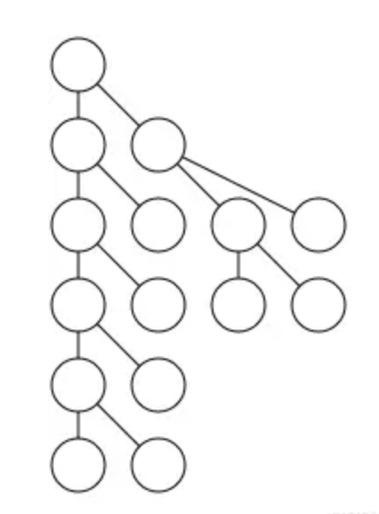

# 绘制一棵漂亮的树

## 1. 问题

- 棵树 T，我们要做的就是试着把它画出来

```tsx
class DrawTree {
  constructor(tree, depth = 0) {
    this.x = -1
    this.y = depth
    this.tree = tree
    this.children = tree.children.map((child) => {
      return new DrawTree(child, depth + 1)
    })
  }
}
```

### 原则

- 原则 1：树的边不应该交叉

- 原则 2：相同深度的节点应该绘制在同一水平线，这能让树的结构更清晰

-`原则 3：树应该尽可能画的紧凑一点`

- `原则4：父节点应该位于子节点中间`

## 2. 解决方案

### 自下而上 尽可能紧凑的树 满足原则 3

```tsx
// 代码3
const nexts = []
const minimum_ws = (tree, depth = 0) => {
  if (nexts[depth] === undefined) {
    nexts[depth] = 0
  }
  tree.x = nexts[depth]
  tree.y = depth
  nexts[depth] += 1
  tree.children.forEach((child) => {
    minimum_ws(child, depth + 1)
  })
}
```



### 原则 4：父节点应该位于子节点中间

### Mods 和 Rockers

```tsx
class DrawTree {
  constructor(tree, depth = 0) {
    this.x = -1 // 节点的x坐标（初始为-1，表示未确定）
    this.y = depth // 节点的y坐标（即深度）
    this.tree = tree // 原始树节点
    this.children = tree.children.map((child) => {
      return new DrawTree(child, depth + 1) // 递归创建子节点
    })
    this.mod = 0 // 调整值，用于后续布局微调
  }

  setup = (tree, depth = 0, nexts = {}, offset = {}) => {
    // 先递归处理所有子节点（后序遍历）
    tree.children.forEach((child) => {
      setup(child, depth + 1, nexts, offset)
    })

    tree.y = depth // 设置当前节点的深度

    let place // 临时位置变量

    // 根据子节点数量决定当前节点的x位置
    if (childrenLength <= 0) {
      // 叶子节点：放在当前深度层的最左可用位置
      place = nexts[depth] || 0
      tree.x = place
    } else if (childrenLength === 1) {
      // 只有一个子节点：放在子节点左边一格
      place = tree.children[0].x - 1
    } else {
      // 多个子节点：放在第一个和最后一个子节点的中间位置
      let s = tree.children[0].x + tree.children[childrenLength - 1].x
      place = s / 2
    }

    // 计算并记录当前深度层需要的偏移量
    offset[depth] = Math.max(offset[depth] || 0, (nexts[depth] || 0) - place)

    // 如果有子节点，应用计算出的偏移量
    if (childrenLength > 0) {
      tree.x = place + offset[depth]
    }

    // 更新当前深度层的下一个可用位置
    if (nexts[depth] === undefined) {
      nexts[depth] = 0
    }
    nexts[depth] += 2

    tree.mod = offset[depth] // 记录当前节点的调整值
  }

  addmods = (tree, modsum = 0) => {
    // 应用累计的调整值到当前节点
    tree.x = tree.x + modsum
    modsum += tree.mod // 累计调整值

    // 递归应用到所有子节点
    tree.children.forEach((child) => {
      addmods(child, modsum)
    })
  }

  layout = (tree) => {
    setup(tree) // 计算初步布局
    addmods(tree) // 应用调整值
    return tree // 返回布局好的树
  }
}
```

### 树作为 Block 块

- 上面算法问题 ，相同的树结构，当放在树的不同位置时，可能会绘制出不同的结构。为了解决这个问题，

- `原则 5：同一个子树无论在树的哪个位置，绘制的结果都应该相同`

#### 思路

对树进行后序遍历
如果一个节点是叶子节点，那么给它一个值为 0 的 x 坐标
否则，在不产生冲突的情况下，将它的右子树尽可能靠近左子树
使用与前面相同的 mod 方式，在 O(n)时间内移动树
将节点放置在其子节点中间
再遍历一次树，将累积的 mode 值加到 x 坐标上

### 树形轮廓算法解析与可视化

#### 关键点

- 计算树的轮廓（左轮廓或右轮廓）

- 根据两棵树的轮廓计算它们之间的最小安全距离，避免重叠

#### 核心概念解析

树的轮廓

- 左轮廓：树每一层最左侧节点的 x 坐标组成的数组

- 右轮廓：树每一层最右侧节点的 x 坐标组成的数组

```tsx
    A
   / \
  B   C
 /   / \
D   E   F

// 假设各节点的x坐标为：A(1), B(0), C(2), D(-1), E(1), F(3)

// 左轮廓：[1 (A), 0 (B), -1 (D)]

// 右轮廓：[1 (A), 2 (C), 3 (F)]
```

```tsx
// 代码7

// 小于
const lt = (a, b) => {
  return a < b
}

// 大于
const gt = (a, b) => {
  return a > b
}

// 将两个数组按位置配对
// [a, b, c],[d, e, f] => [[a, d], [b, e], [c, f]]
const zip = (a, b) => {
  let len = Math.min(a.length, b.length)
  let arr = []
  for (let i = 0; i < len; i++) {
    arr.push([a[i], b[i]])
  }
  return arr
}
const push_right = (left, right) => {
  // 左边树的右轮廓
  let wl = contour(left, lt)
  // 右边树的左轮廓
  let wr = contour(right, gt)
  let res = zip(wl, wr)
  let arr = res.map((item) => {
    return item[0] - item[1]
  })
  return Math.max(...arr) + 1
}
// 获取一棵树的轮廓
const contour = (tree, comp, level = 0, cont = null) => {
  // 根节点只有一个，所以直接添加
  if (cont === null) {
    cont = [tree.x]
  } else if (cont.length < level + 1) {
    // 该层级尚未添加，直接添加
    cont.push(tree.x)
  } else if (comp(cont[level], tree.x)) {
    // 该层级已经有值，所以进行比较
    cont[level] = tree.x
  }
  tree.children.forEach((child) => {
    contour(child, comp, level + 1, cont)
  })
  return cont
}
```

### 树形布局中的线程优化技术解析

#### 线程概念解析

在树形布局上下文中，线程(thread)是一种特殊的指针，它连接同一层级但不具有父子关系的节点，用于快速访问轮廓节点而不需要遍历整个子树。

#### 线程的特点：

- 非父子关系：连接同一层级的节点

- 优化遍历：避免全树扫描，快速找到轮廓边界

- 虚线表示：在可视化中用虚线表示（实线表示真正的父子关系）

```tsx
// 代码8
// 获取节点的右轮廓下一个节点
const nextright = (tree) => {
  if (tree.thread) {
    // 如果有线程，直接跳转
    return tree.thread
  } else if (tree.children.length > 0) {
    // 否则取最右子节点
    return tree.children[tree.children.length - 1]
  } else {
    // 叶子节点没有下一个
    return null
  }
}

// 获取节点的左轮廓下一个节点
const nextleft = (tree) => {
  if (tree.thread) {
    // 如果有线程，直接跳转
    return tree.thread
  } else if (tree.children.length > 0) {
    // 否则取最左子节点
    return tree.children[0]
  } else {
    // 叶子节点没有下一个
    return null
  }
}
const contour = (left, right, max_offset = 0, left_outer = null, right_outer = null) => {
  // 初始化外层节点
  if (left_outer === null) left_outer = left
  if (right_outer === null) right_outer = right

  // 计算当前层的最大偏移需求
  if (left.x - right.x > max_offset) {
    max_offset = left.x - right.x
  }

  // 获取下一层的内外层节点
  let lo = nextleft(left) // 左树左轮廓下一节点
  let li = nextright(left) // 左树右轮廓下一节点
  let ri = nextleft(right) // 右树左轮廓下一节点
  let ro = nextright(right) // 右树右轮廓下一节点

  // 如果还有内层节点，继续递归
  if (li && ri) {
    return contour(li, ri, max_offset, lo, ro)
  }

  return max_offset + 1 // 返回需要右推的距离(+1保证不重叠)
}
```
